# Module 1: The foundation

## Cloud setup & access

### Introduction

Before you deploy any code, you need a secure environment. We use DigitalOcean here, but these concepts apply to AWS EC2, Linode, or even a Raspberry Pi.

By the end of this section, you will have a server running Ubuntu 24.04 LTS, accessed securely via SSH keys, with password authentication completely disabled.

> [!TIP]
> Prefer video? Watch this section walkthrough: [https://www.youtube.com/watch?v=e7Tz_YRfoCc](https://www.youtube.com/watch?v=e7Tz_YRfoCc)

<!-- This comment is here to satisfy the MD028 rule -->

> [!IMPORTANT]
> Throughout this guide, you will see text inside angle brackets like `<your_username>` or `<your_key_name>`. These are **placeholders**. You must replace them with your actual values and **remove the brackets** when running the commands.

### Create the project

In this book, we use DigitalOcean to host your web application. If you don’t have an account, [create one here](https://m.do.co/c/4f9010fc5eb3) to get **$200 in free credit**.

After creating your account, create a project to hold your resources. Click on the **New project** button.


_The location of the **+ New Project** button on the DigitalOcean dashboard._

Give your project a name and a description. Choose a **descriptive** name so you can remember the purpose of the project later. Use a name that reflects your application. Click on **Create Project** when you are done.

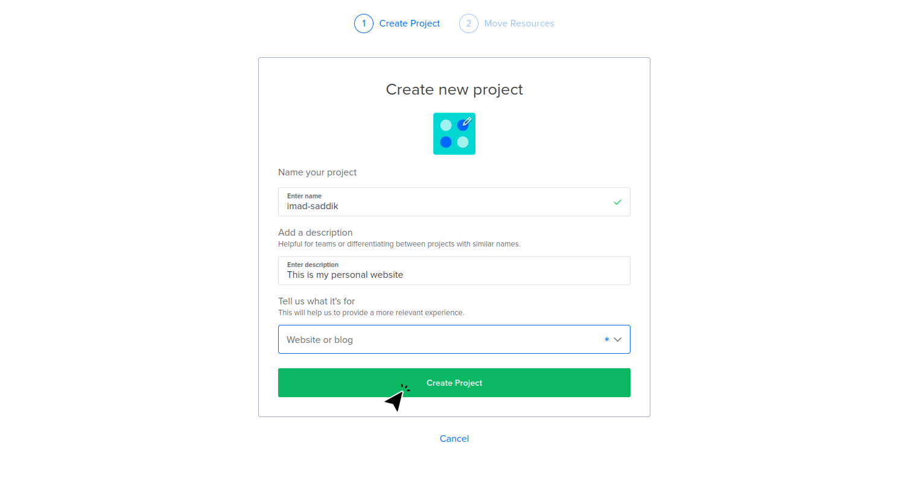
_Give the project a name and a description._

DigitalOcean will ask if you want to move resources to this project. Click **Skip for now** since you are starting from scratch.

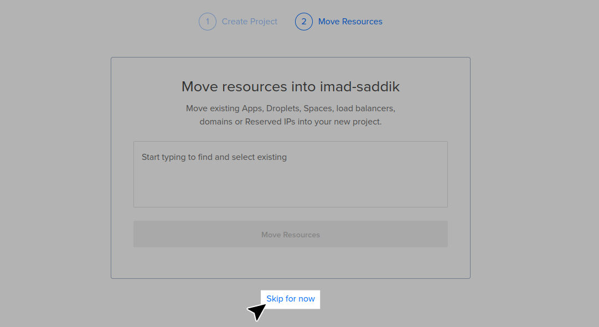
_Skip this step because you don’t have any resources yet._

### Create the droplet

Now, create the virtual machine. In DigitalOcean, these are called “droplets”. Click on **Create** in the top menu, then select **droplets**.

A droplet is a Linux-based virtual machine that runs on virtualized hardware. This machine will host the code for your website.

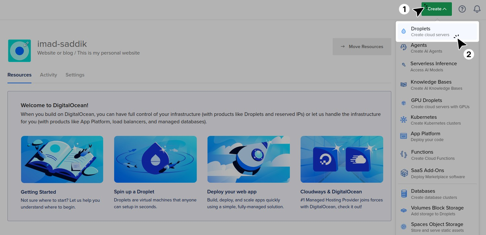
_Click **Create**, then select **droplets** to start setting up your server._

Choose a **Region** where your VM will be hosted. Always select a region geographically near you or your target users. I live in Morocco, so I chose the Frankfurt (Germany) datacenter.

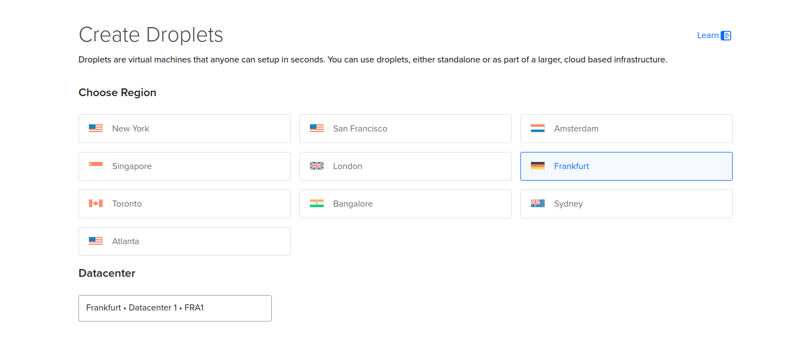
_Select the region where your droplet will be hosted._

Next, choose an **Operating System**. Linux is the standard for servers. Select **Ubuntu 24.04 (LTS)** because it is stable and well-supported.

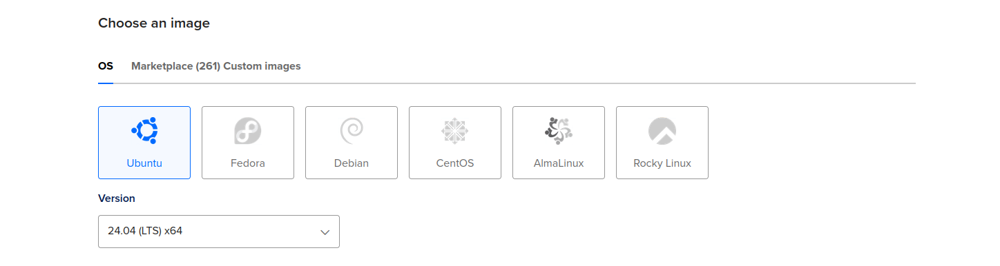
_Choose the operating system for your droplet._

Now you need to choose the size of your virtual machine. You can pick between **shared CPU** and **dedicated CPU**. Inside each option, you must decide how much **RAM**, **disk space**, and how many **CPU cores** you want.

Dedicated VMs are more expensive because the resources are **reserved only for you**. Adding more RAM, disk space, or CPU cores will also increase the price.

Fortunately, you can **change the droplet size later** if needed. For now, create a droplet with a shared CPU and the lowest resources. This costs **$4 per month**, and I will show you how to upgrade it later.

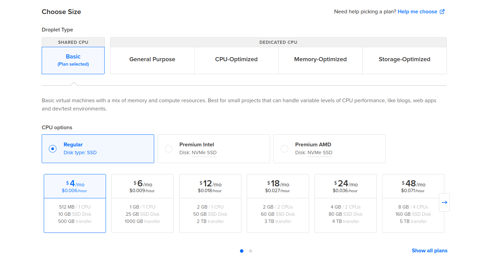
_Select the droplet size that fits your needs._

If you need more storage, click **Add Volume** and enter the size in GB. This feature is not free; it costs **$1 per month per 10 GB**. You can also enable automatic backups if you need them.

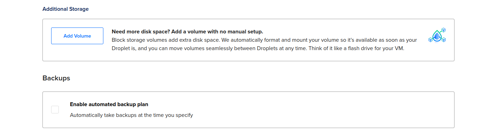
_Additional storage and backup options._

### Configure authentication

This is a critical security step. You can access your server using a **password** or an **SSH key**.

Select **SSH Key** and click on the **Add SSH Key** button.

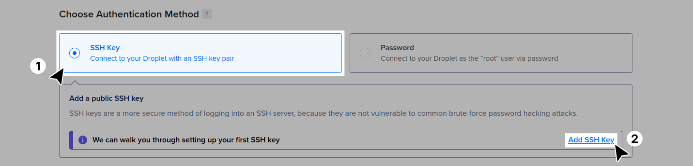
_Select SSH key for better security._

**Always use an SSH key.** Passwords are vulnerable to brute-force attacks, whereas SSH keys are significantly more secure. Think of it like a real lock and key:

- The **public key** is the lock. You put this on the server (the droplet). Anyone can see the lock, but that does not help them open the door.
- The **private key** is the physical key. You keep this on your computer. You never share it.

When you try to connect, the server checks if your "key" fits its "lock." If it does, you get in without a password.

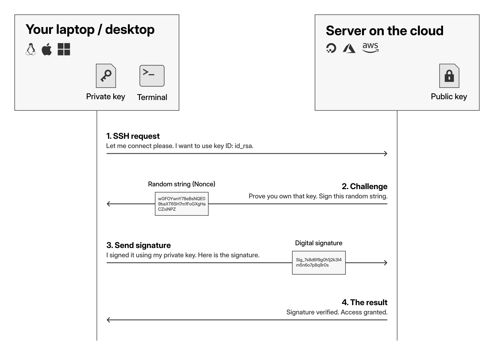
_How SSH keys verify your identity._

The diagram above shows the conversation that happens between your computer and the server:

1. **SSH request**: Your computer contacts the server and says, "I want to connect using this specific key ID."
2. **Challenge**: The server is cautious. It sends back a random string of characters (called a nonce) and says, "Prove you own the private key by signing this random message."
3. **Send signature**: Your computer takes that random message and "signs" it using your private key. This creates a unique digital signature that gets sent back to the server.
4. **The result**: The server uses the public key (which you uploaded to it) to verify the signature. If the signature matches, the server knows you have the private key and grants access.

To generate a key, open the terminal on your local computer. Use the [Ed25519](https://en.wikipedia.org/wiki/EdDSA#Ed25519) algorithm, which is faster and more secure than the older RSA standard.

```bash
ssh-keygen -t ed25519 -f ~/.ssh/<your_key_name> -C "<key_comment>"
```

Here is what the arguments do:

- `-t ed25519`: Specifies the modern Ed25519 algorithm.
- `-f ~/.ssh/<your_key_name>`: Saves the key with a specific name so you don’t overwrite your default keys.
- `-C "<key_comment>"`: Adds a comment to help you identify the key.

The system will ask you to add a **passphrase**. This is an extra password to protect your private key. If someone steals your private key file, they cannot use it without this passphrase.

```bash
ssh-keygen -t ed25519 -f ~/.ssh/<your_key_name> -C "<key_comment>"

# Output:
Generating public/private ed25519 key pair.
Enter passphrase for "/home/<your_username>/.ssh/<your_key_name>" (empty for no passphrase):
```

I strongly recommend adding a passphrase for your personal key.

> [!NOTE]
> If you need a key for a CI/CD pipeline later (to deploy code automatically), generate a separate key pair without a passphrase. Never remove the passphrase from your personal key.

You have generated the key pair. Now, copy the public key.

```bash
cat ~/.ssh/<your_key_name>.pub
```

The command displays your public key. Copy the entire text starting with `ssh-ed25519`. Paste it into the box, give it a name, and click **Add SSH Key**.

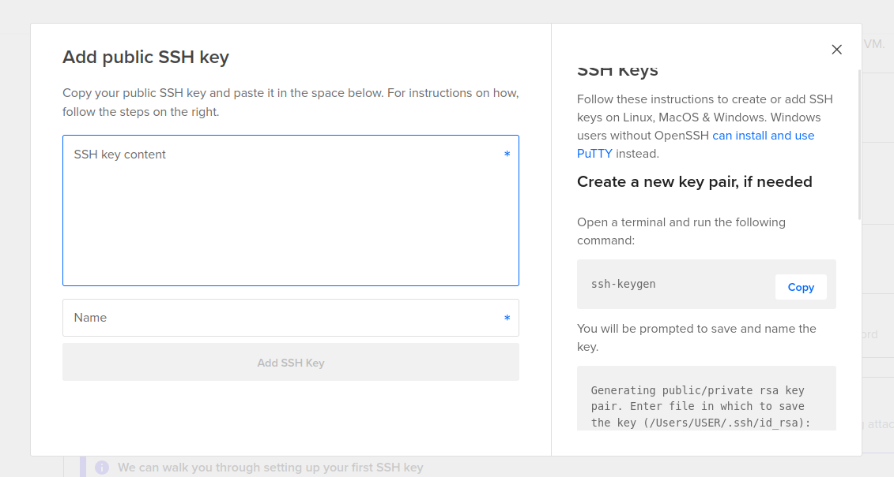
_Add the public SSH key._

You can add more than one SSH key by clicking the **New SSH Key** button. This allows you to add a specific key for your CI without a passphrase, while keeping the one on your computer protected with a passphrase.

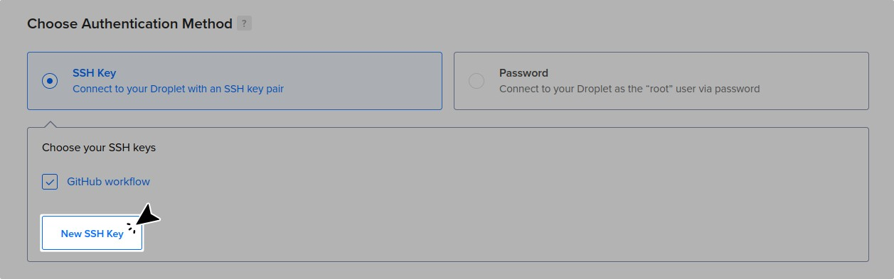
_Add multiple SSH keys._

You are almost done. Select **Add improved metrics monitoring and alerting** because it is free.

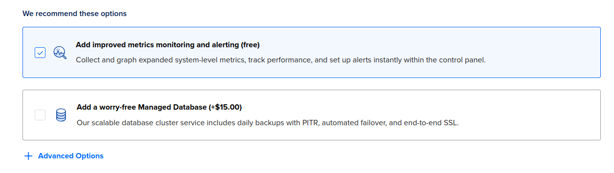
_Select the free monitoring option._

### Finalize and connect

Give your droplet a name you can recognize, add tags, and assign it to the project you created. You can deploy multiple droplets, but for now, keep the quantity set to **1 droplet**.

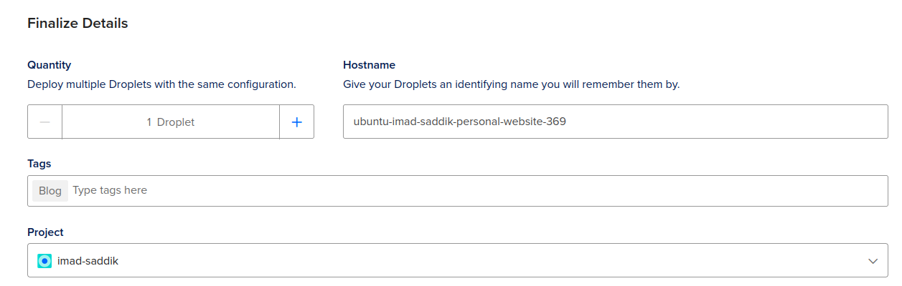
_Give your droplet a name, tags, and assign it to a project._

Click on **Create droplet**. The site redirects you to the project page. Under **Resources**, you should see a **green dot** next to your droplet. This means it is running.

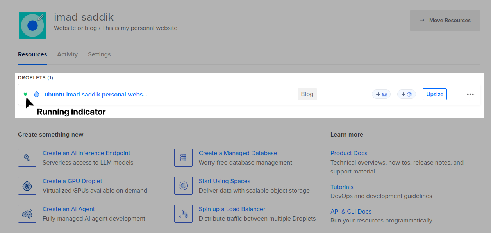
_Ensure that the droplet is running and assigned to the project._

Later, if you find that this VM cannot handle the traffic, you can click on **Upsize** to add more resources.

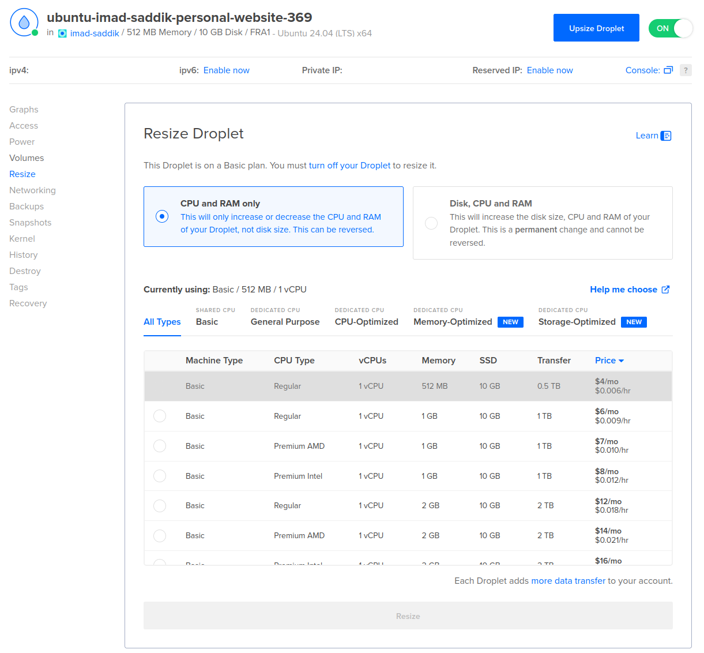
_Increase resources by upsizing._

You are now ready to connect to your VM. Find the **IP address** on the project page. Copy the IP address shown next to your droplet's name.

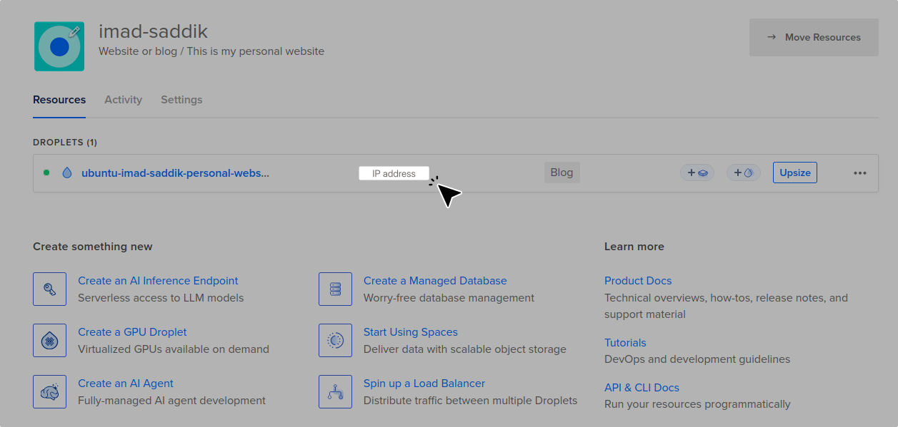
_Locate the IP address of the VM._

Use the SSH command to connect to the machine. Pass your private key using the `-i` flag and add your IP address after `root@`.

```bash
ssh -i ~/.ssh/<your_key_name> root@<your_droplet_ip>
```

A security warning appears about the authenticity of the host. Type `yes` and hit `Enter` to continue.

```text
The authenticity of host '<your_droplet_ip> (<your_droplet_ip>)' can't be established.
ED25519 key fingerprint is SHA256:...
This key is not known by any other names.
Are you sure you want to continue connecting (yes/no/[fingerprint])?
```

Sometimes, the server is not fully ready even though the status says "Running". If you see a **Connection closed** message immediately after typing yes, don’t worry.

If this happens, just wait a few seconds and run the SSH command again. It should work the second time.

```text
Are you sure you want to continue connecting (yes/no/[fingerprint])? yes
Warning: Permanently added '<your_droplet_ip>' (ED69696) to the list of known hosts.
Connection closed by <your_droplet_ip> port 22
```

Once connected, you will see a welcome message similar to this:

```text
*** System restart required ***

The programs included with the Ubuntu system are free software;
the exact distribution terms for each program are described in the
individual files in /usr/share/doc/*/copyright.

Ubuntu comes with ABSOLUTELY NO WARRANTY, to the extent permitted by
applicable law.

root@<your_hostname>:~#
```

Update your VM packages by running the following commands:

```bash
sudo apt update
sudo apt upgrade
```

> [!IMPORTANT]
> If you see a configuration screen during the update, select **keep the local version currently installed**. This option ensures you keep the working SSH configuration that DigitalOcean set up for you.

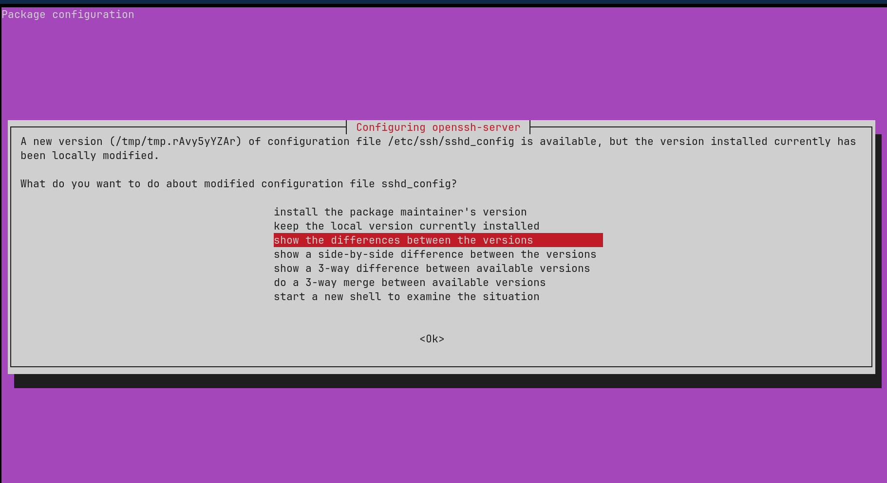
_Handle the configuration conflict._

Reboot the machine to complete the upgrade and start using the new kernel and packages.

```bash
reboot
```

The connection will close, but you can connect via SSH to the server again after it reboots. If you want to exit the VM, type exit and hit `Enter` or hit `Ctrl+D`.

### Create a non-root user and configure SSH access

Running everything as **root** is dangerous. If you make a mistake, it might be unrecoverable. Also, if an attacker finds a vulnerability in your app while it is running as root, they gain full control of your server.

Create a new user to act as a security barrier.

```bash
adduser <your_username>
```

It will ask you to set a password and fill in some details. You can skip the details by pressing `Enter`.

```text
New password:
Retype new password:
passwd: password updated successfully
Changing the user information for <your_username>
Enter the new value, or press ENTER for the default
Full Name []: <your_fullname>
Room Number []:
Work Phone []:
Home Phone []:
Other []:
Is the information correct? [Y/n] y
info: Adding new user `<your_username>' to supplemental / extra groups `users' ...
info: Adding user `<your_username>' to group `users' ...
```

Give the new user administrative privileges ([sudo](https://www.sudo.ws/news/)).

```bash
usermod -aG sudo <your_username>
```

Now, log out of the server (`exit` or `Ctrl+D`) and attempt to log in as your new user.

```bash
ssh -i ~/.ssh/<private_key_name> <your_username>@<your_droplet_ip>
```

You will get an error. This happens because the SSH key you authorized exists only in the `root` user's `authorized_keys` file. The new user (`<your_username>`) has an empty list. You need to copy the key from `root` to `<your_username>`.

```text
<your_username>@<your_droplet_ip>: Permission denied (publickey).
```

Log back in as **root**.

```bash
ssh -i ~/.ssh/<private_key_name> root@<your_droplet_ip>
```

Run these commands to copy the authorized keys to the new user. Copy the entire directory and preserve the strict root permissions using the `--preserve=mode` flag.

```bash
# Copy the .ssh directory, preserving the strict file permissions
cp -r --preserve=mode /root/.ssh /home/<your_username>/

# Give the new user ownership of this directory
chown -R <your_username>:<your_username> /home/<your_username>/.ssh
```

Now, exit and try to log in as your new user again.

```bash
ssh -i ~/.ssh/<private_key_name> <your_username>@<your_droplet_ip>
```

It should work now. You will see a prompt like this:

```text
To run a command as administrator (user "root"), use "sudo <command>".
See "man sudo_root" for details.

<your_username>@<your_hostname>:~$
```

Before you move on to the next step, you must verify that your new user can actually perform administrative tasks. If you disable root login and find out your user cannot use sudo, you will be locked out of your own server.

```bash
sudo ls /root
```

If the command works, you will see the contents of the root directory. If you get an error saying your user is "not in the sudoers file", **STOP**. Do not disable root login until you fix the user permissions.

From now on, you will stop using `root` and use this account instead.

### Disable root SSH access

Now that your new user is set up, you should disable direct login for the root account. This reduces your attack surface.

Open the SSH configuration file:

```bash
sudo nano /etc/ssh/sshd_config
```

Find the line `PermitRootLogin yes` and change it to `no`. Also, find the line `PasswordAuthentication yes` and change it to `no`. This explicitly forces the server to use SSH keys and reject all password login attempts.

> [!TIP]
> To search in nano, press `Ctrl+W`, type the search term, and hit `Enter`.

```text
PermitRootLogin no
PasswordAuthentication no
```

Save the file by pressing `Ctrl+O` (to write out/save), then exit nano with `Ctrl+X`. After that, restart the SSH service to apply the changes.

```bash
sudo systemctl restart ssh
```

Now, exit the server.

```bash
exit
```

Try to log in as `root`.

```bash
ssh -i ~/.ssh/<private_key_name> root@<your_droplet_ip>
```

You should see a message indicating that authentication was rejected. Depending on your local SSH configuration, you will see one of these two errors:

```text
# Scenario A: Standard rejection
Permission denied (publickey).

# Scenario B: If you have many SSH keys on your computer
Received disconnect from <your_droplet_ip> port 22:2: Too many authentication failures
```

Both errors mean the same thing: The root account is now locked against remote login.

> [!NOTE]
> Setting `PasswordAuthentication no` is optional because DigitalOcean already disabled password authentication when you created the droplet (assuming you selected SSH key authentication).
>
> However, it is good practice to set it manually. This ensures your server remains secure if you run your setup scripts on a different provider that does not create those default cloud settings.
>
> Unlike many Linux services where the "last configuration wins", SSH uses a "first match wins" rule. It applies the first value it finds for a setting and ignores the rest.
>
> DigitalOcean's default `sshd_config` file includes this line at the very top:
>
> ```text
> Include /etc/ssh/sshd_config.d/*.conf
> ```
>
> This means SSH reads the files in the `.d` folder before reading the rest of your main file. You can see this hidden rule by running:
>
> ```bash
> sudo grep -r "PasswordAuthentication" /etc/ssh/sshd_config.d/
> ```
>
> You will see something like this:
>
> ```text
> /etc/ssh/sshd_config.d/50-cloud-init.conf:PasswordAuthentication no
> /etc/ssh/sshd_config.d/60-cloudimg-settings.conf:PasswordAuthentication no
> ```
>
> Because SSH sees this "no" first, it locks that setting in.
>
> So why did we edit the main file? We edit the main `sshd_config` file as a safety net.
>
> If you ever use your setup script to configure a fresh server on a bare-metal provider or a different cloud, that `50-cloud-init.conf` file might not exist. By explicitly setting `PasswordAuthentication no` in your main configuration, you guarantee your server is secure regardless of the hosting provider.

### Simplify SSH access

Typing the full SSH command with the key path and IP address every time is tedious. You can configure your local SSH client to remember these details for you.

On your **local computer** (not the server), open or create the SSH config file:

```bash
nano ~/.ssh/config
```

Add the following configuration block at the bottom of the file:

```text
Host my-website
    HostName <your_droplet_ip>
    User <your_username>
    IdentityFile ~/.ssh/<private_key_name>
    IdentitiesOnly yes
```

Here is what these lines do:

- **Host:** This is the shortcut name you want to use.
- **HostName:** The actual IP address of your server.
- **User:** The username you created on the server.
- **IdentityFile:** The path to the specific private key for this server.
- **IdentitiesOnly:** This tells SSH to **only** use the specific key file listed here. This prevents the "Too many authentication failures" error if you have many keys on your computer.

Save the file and exit. Now, instead of typing this long command:

```bash
ssh -i ~/.ssh/<private_key_name> <your_username>@<your_droplet_ip>
```

You can simply type:

```bash
ssh my-website
```

Your computer will automatically look up the IP, user, and key, and log you straight in.

### What is next?

You have successfully configured a clean Ubuntu server and secured it with SSH keys. However, your server is still exposed to the open internet.

In the next subchapter, **The firewall strategy**, we will lock down the network. You will learn how to configure [UFW](https://www.digitalocean.com/community/tutorials/ufw-essentials-common-firewall-rules-and-commands) to block unwanted traffic, install Fail2Ban to stop brute-force attacks, and use the Recovery Console if you ever get locked out.

## The firewall strategy

### Introduction

Right now, your server is like a house with the front door locked (SSH keys) but every window wide open. By default, a fresh Linux server accepts connections on any port. This is not ideal.

In this section, you will configure a firewall to block all incoming traffic by default, allowing only the connections you explicitly trust, using **UFW** (Uncomplicated Firewall). You will also install **Fail2Ban** to automatically ban bots that try to guess your SSH keys.

### Configure the firewall

Ubuntu comes with a tool called **UFW** (Uncomplicated Firewall). It is designed to be easy to use while providing robust security.

Check the current status of your firewall.

```bash
sudo ufw status
```

It should say `Status: inactive`. Before you activate it, you must explicitly allow SSH connections.

> [!IMPORTANT]
> If you enable the firewall without allowing SSH first, you will lock yourself out of the server immediately.

```bash
sudo ufw allow OpenSSH
```

Now that SSH is allowed, you can safely enable the firewall.

```bash
sudo ufw enable
```

The system will warn you that this command might disrupt existing SSH connections. Type `y` and hit `Enter`.

```plaintext
Command may disrupt existing ssh connections. Proceed with operation (y|n)? y
Firewall is active and enabled on system startup
```

Verify the status again to see the active rules.

```bash
sudo ufw status verbose
```

The output gives you a detailed list. Pay close attention to the Default policy and the ALLOW IN rules.

```plaintext
Status: active
Logging: on (low)
Default: deny (incoming), allow (outgoing), disabled (routed)
New profiles: skip

To                             Action      From
--                             ------      ----
22/tcp (OpenSSH (v6))          ALLOW IN    Anywhere (v6)
22/tcp (v6)                    ALLOW IN    Anywhere (v6)
```

Here is how to interpret this output:

- **Default: deny (incoming)**: This is the most important rule. It means every single port on your server is blocked unless you explicitly allow it.
- **ALLOW IN**: These are your exceptions. Right now, you are only allowing traffic for SSH (port 22).

> [!NOTE]
> Later in the guide, when you install the web server ([Nginx](https://nginx.org/)), you will come back here to open ports [80 (HTTP)](https://en.wikipedia.org/wiki/Port_%28computer_networking%29#Common_port_numbers) and [443 (HTTPS)](https://en.wikipedia.org/wiki/Port_%28computer_networking%29#Common_port_numbers). For now, keeping them closed is safer.

### Protect SSH with Fail2Ban

If you check your authentication logs (`/var/log/auth.log`), you will likely see a stream of failed login attempts. These are automated bots scanning the internet, trying to guess passwords for common usernames like `admin`, `root`, or `test`.

Here is a real example from my own server logs:

```plaintext
2025-12-07T10:59:44 sshd[615989]: Invalid user docker from 142.93.130.134
2025-12-07T11:01:28 sshd[616006]: Invalid user dspace from 142.93.130.134
2025-12-07T11:05:09 sshd[616037]: Invalid user elastic from 142.93.130.134
2025-12-07T11:05:38 sshd[616045]: Invalid user admin from 94.156.152.7
```

Even though they cannot get in (because you disabled password authentication), they waste your server's CPU and fill up your disk space with logs.

To stop this, install **Fail2Ban**. This tool monitors your logs in real time. If an IP address fails to log in too many times, Fail2Ban instantly updates the firewall to block that IP completely.

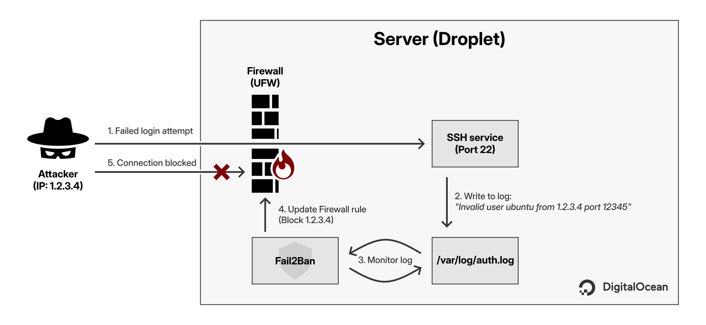
_How Fail2Ban turns log entries into firewall rules._

Fail2Ban is available in Ubuntu's default repositories. Install it with this command:

```bash
sudo apt install fail2ban -y
```

By default, Fail2Ban only bans attackers for 10 minutes. This is often too short; persistent bots will just come back later. To increase this to 1 day, create a local configuration file.

> [!Important]
> Never edit the `.conf` file directly, as system updates will overwrite it. Always use a `.local` file for your customizations.

Create the file using nano.

```bash
sudo nano /etc/fail2ban/jail.local
```

Paste the following configuration:

```ini
[sshd]
enabled = true
bantime = 1d
maxretry = 5
findtime = 10m
```

Here is what these settings do:

- `enabled`: Turns on protection for SSH.
- `bantime`: Bans the IP for 1 day.
- `maxretry`: Allows a user to fail 5 times before being banned.
- `findtime`: The window of time (10 minutes) in which those 5 failures must occur to trigger a ban.

Save and exit (`Ctrl+O`, `Enter`, `Ctrl+X`). Restart the Fail2Ban service for the new configuration to take effect:

```bash
sudo systemctl restart fail2ban
```

Once installed, enable the service to start automatically when the server reboots.

```bash
sudo systemctl enable fail2ban
sudo systemctl start fail2ban
```

You can verify your new ban time (86400 seconds = 24 hours) with this command:

```bash
sudo fail2ban-client get sshd bantime
```

To see if the tool is working, check the status of the SSH jail.

```bash
sudo fail2ban-client status sshd
```

The output will look like this:

```plaintext
Status for the jail: sshd
|- Filter
| |- Currently failed: 4
| |- Total failed: 27
| `- Journal matches: _SYSTEMD_UNIT=sshd.service + _COMM=sshd `- Actions
|- Currently banned: 1
|- Total banned: 1
`- Banned IP list: 142.93.130.134
```

If you see IPs in the "Banned IP list", it means the tool is working. That specific IP from the logs is now blocked and can no longer connect to the server.

### Recovery console

What happens if you make a mistake? For example, if you accidentally run `ufw enable` before allowing OpenSSH, or if you configure SSH keys incorrectly and lose access to your private key.

If you get locked out, DigitalOcean provides a Recovery Console. This feature gives you direct access to the machine through your browser, bypassing SSH entirely.

1. Go to the DigitalOcean dashboard and click on your project.
2. Click the name of your droplet to open its details.
3. Click on the **Access** button in the left sidebar.
4. Click **Launch Recovery Console**.

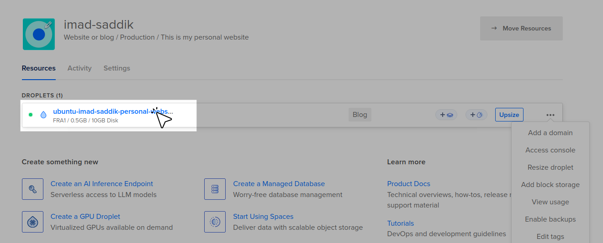
_Access the Recovery Console from the DigitalOcean dashboard._

Once the console opens, you will need to log in.

> [!WARNING]
> The Recovery Console requires a password to log in. If you created your user without a password, or if you forgot it, you will need to reset the root password first using the "Reset Root Password" button on the same Access page.

The keyboard mapping in the Recovery Console can be tricky. It is a good idea to type your password in the username field first just to see if the characters match what you are pressing, then delete it and log in properly.

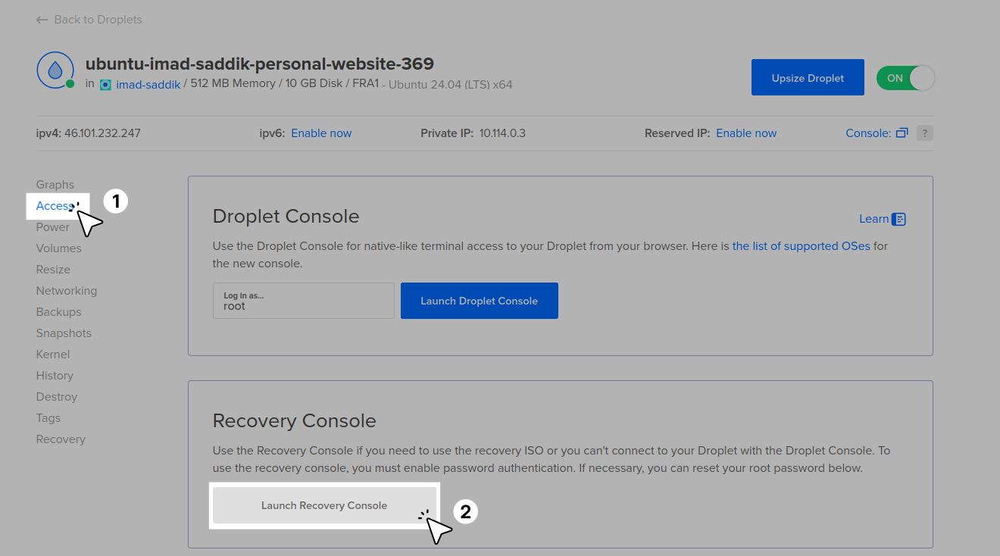
_The Recovery Console login screen._

Once you are logged in, you can run the missing command to fix the issue. For example, if you forgot to allow SSH:

```bash
sudo ufw allow OpenSSH
```

After fixing the issue, close the browser window and try to SSH from your terminal again.

```bash
ssh my-website
```

### What is next?

Your foundation is solid. You have a secure server that blocks unauthorized traffic and automatically bans attackers.

In the next module, **Module 2: The Application**, we will shift focus from security to software. You will learn how to prepare the environment by installing **Python 3.13** and **Node.js**, setting up [Swap memory](https://en.wikipedia.org/wiki/Memory_paging) to handle builds on a low-RAM server, and configuring [Gunicorn](https://gunicorn.org/) and [Supervisor](https://supervisord.org/) to keep your application running reliably in the background.
