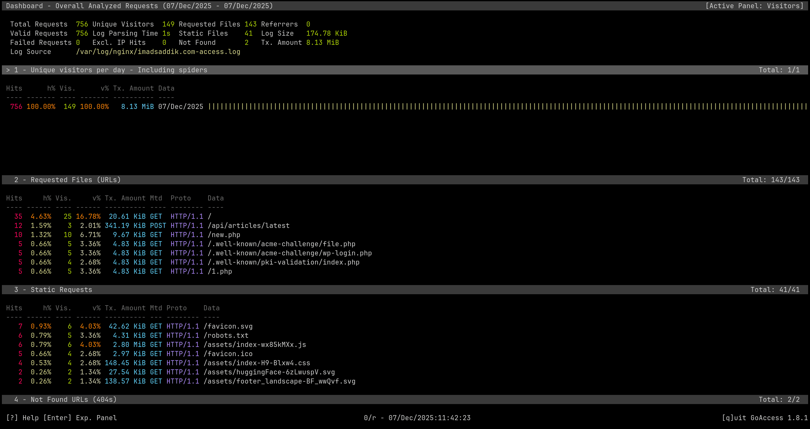
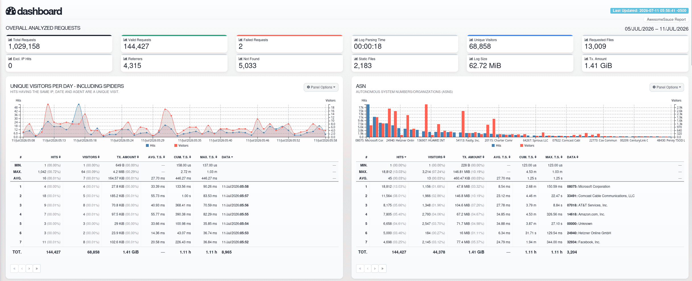
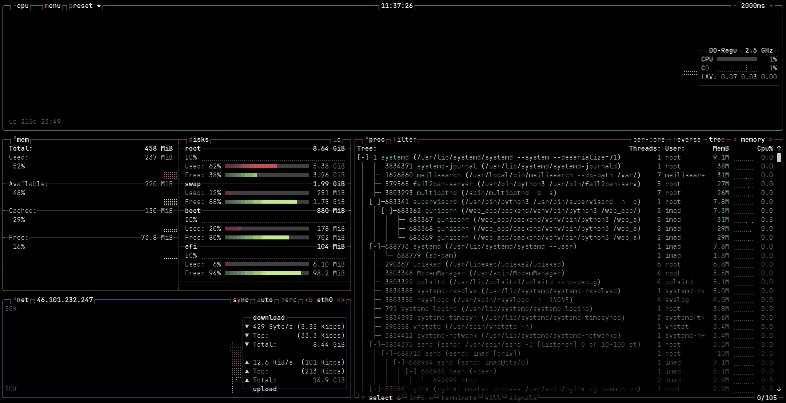
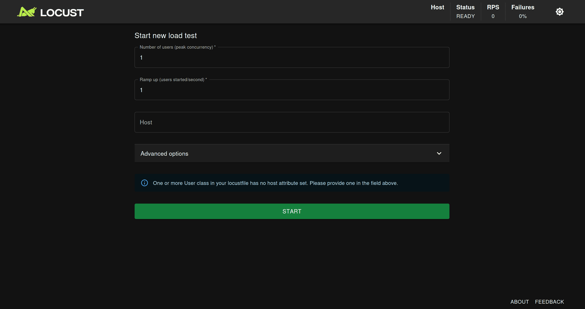
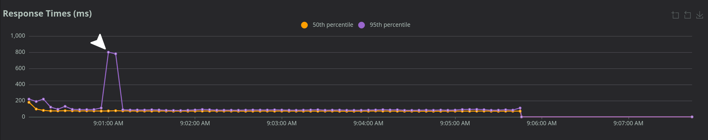
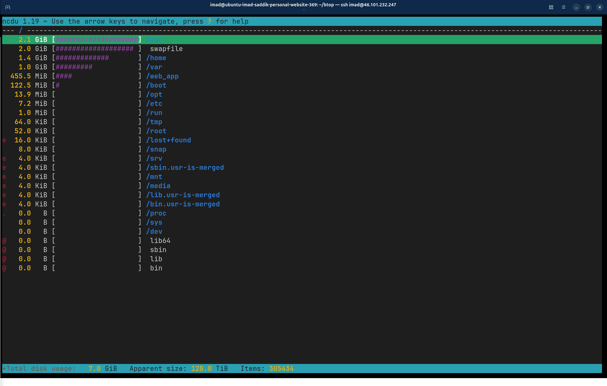

# Module 6: Optimization & maintenance

## Observability

### Introduction

Your deployment pipeline is running smoothly, your application is live, and traffic is flowing through Cloudflare. But running a server without visibility is like driving a car with a blacked-out windshield. You might be moving forward, but you cannot see the obstacles until you crash.

In this subchapter, you will transition from a blind deployment to a fully observed system. You will learn how to monitor your traffic natively without using heavy, privacy-invasive scripts like Google Analytics. You will install a terminal-based system monitor to track your resource limits in real time, and you will learn how to read your access logs to identify, isolate, and permanently ban web bots and malicious actors at the network edge.

### Server-side analytics with GoAccess

You naturally want to know how many people are using your website, which content is popular, and where your visitors come from. However, loading client-side JavaScript tracking scripts hurts frontend rendering speeds and forces you to show intrusive cookie consent banners to protect user privacy.

Since you are running Nginx, you already have a perfect data source: your access logs. Every single request for a web page, an API endpoint, or a static asset is recorded automatically by Nginx. You can parse these raw logs in real time using [GoAccess](https://goaccess.io), a fast, open-source terminal log analyzer.

Install GoAccess on your server:

```bash
sudo apt install goaccess -y
```

To view a live analysis directly inside your active SSH session, point GoAccess to your production Nginx access log file and specify the combined log format:

```bash
sudo goaccess /var/log/nginx/<your_domain>-access.log --log-format=COMBINED
```

The terminal will instantly switch to an interactive, graphical dashboard layout.

_The GoAccess interactive terminal dashboard displays web server statistics directly inside your SSH session._


You can navigate this dashboard using your arrow keys, press `Tab` to shift between data panels, or press `q` to exit back to your standard shell. The tool breaks your raw log lines down into important metrics, including:

* **Unique visitors:** Tracks actual daily visitor trends separate from total page views.
* **Requested files:** Shows exactly which URL endpoints are drawing traffic.
* **Static assets:** Isolates image, CSS, and JS file requests from application logic.
* **HTTP status codes:** Highlights server anomalies, such as tracking how often users hit 404 or 500 errors.

### Build a secure web dashboard

While a terminal interface is highly efficient for quick checks over SSH, you might prefer a visual dashboard accessible from a web browser. GoAccess can generate a clean, standalone HTML dashboard. However, since this dashboard displays internal server traffic patterns, you must protect it so the public cannot access it.

You will use HTTP basic authentication to lock down the file. First, install the utility suite containing the password generation tools:

```bash
sudo apt install apache2-utils -y
```

Now, generate an encrypted password file. You will place it inside the secure Nginx configuration directory:

```bash
sudo htpasswd -c /etc/nginx/.htpasswd admin
```

The system will prompt you to enter and verify a strong password for your `admin` user.

Next, open your primary Nginx server configuration file to create a routing rule for your analytics file:

```bash
sudo nano /etc/nginx/sites-available/<your_domain>.com
```

Locate your secure, port 443 `server` block. Paste this location directive right above your general SPA fallback routes:

```nginx
location = /analytics.html {
    root /web_app/frontend/dist;
    auth_basic "Restricted Area";
    auth_basic_user_file /etc/nginx/.htpasswd;
}
```

Save the file and exit the editor. Test the configuration structure and reload the server to apply the authentication block:

```bash
sudo nginx -t
sudo systemctl reload nginx
```

Now, manually trigger GoAccess to compile your current access log data into a static HTML report placed inside your frontend distribution folder:

```bash
sudo goaccess /var/log/nginx/<your_domain>-access.log -o /web_app/frontend/dist/analytics.html --log-format=COMBINED
```

Open your browser and navigate to `https://<your_domain>.com/analytics.html`. The browser will instantly pause and prompt you for your username and password. Enter your credentials to access the full graphical dashboard interface.


_The secure GoAccess HTML dashboard displaying interactive charts and detailed request metrics._

### Log rotation and automation

The HTML report you just generated is static. It only shows data captured up to the exact second you ran the command. To keep it accurate, you need to automate the compilation process.

Furthermore, Linux systems use a mechanism called log rotation ([logrotate](https://linux.die.net/man/8/logrotate)) to prevent files from growing indefinitely. Every night, the system compresses yesterday's Nginx logs into a separate file ending in `.gz`. If your script only reads the active text log, your web dashboard will reset to zero every morning.

To fix both issues, you will create an automated cron job that pipes your active and compressed logs directly into GoAccess:

```bash
sudo crontab -e
```

Go to the bottom of the cron file and add this entry to rebuild the dashboard every hour on the hour:

```text
0 * * * * zgrep -h . /var/log/nginx/<your_domain>-access.log* | goaccess - -o /web_app/frontend/dist/analytics.html --log-format=COMBINED
```

Here is exactly what this command is doing:

* `zgrep -h .`: The `zgrep` utility allows Linux to search inside compressed files without wasting time decompressing them to disk first. The `*` wildcard tells it to look at both your current log file and your old `.gz` backups.
* `|` (Pipe): Passes the entire historical data stream directly into GoAccess.
* `-` (Dash): Tells GoAccess to read the incoming log data from standard input instead of opening a physical file path.

### Monitor system resources with Btop

With your traffic analytics active, you now need to monitor the resource performance of your server. Running a full stack of Nginx, FastAPI, and Meilisearch inside a low-RAM environment leaves very little room for error.

Ubuntu includes a classic monitor called `top`, but it is text-heavy and difficult to read at a glance. You will install **Btop**, a modern, terminal-based resource monitor that visualizes your processes, memory trees, and CPU states cleanly.

Install Btop from the operating system package manager:

```bash
sudo apt install btop -y
```

> [!NOTE]
> If your distribution does not provide Btop through its default repositories, use the distribution's documented package source for your architecture.

If your distribution does not provide a suitable package, install the release archive for your architecture:

```bash
# Download the matching Btop release archive using the project's official release source.
tar -xjf btop-x86_64-linux-musl.tbz
```

Move into the extracted directory and install the tool globally:

```bash
cd btop
sudo make install
```

By default, standard Linux security boundaries prevent non-root processes from reading low-level hardware sensors like power usage or detailed CPU core metrics. Grant Btop direct sensor access by setting system capabilities on the binary:

```bash
sudo make setcap
```

Return to your main directory, clean up the installer files, and launch Btop:

```bash
cd ..
rm -rf btop btop-x86_64-linux-musl.tbz
btop
```


The terminal will switch into a dynamic dashboard displaying your server's performance metrics.


_The Btop interface visualizes CPU load, memory utilization, and active process hierarchies simultaneously._

When running a full stack on a small VM with only 512MB or 1GB of RAM, you should closely watch these specific indicators:

* **The memory map (Left):** If your RAM fills up with active processes, the Linux kernel will start moving inactive, cold memory pages into your slower swap file to protect the system from running out of memory.
* **The process tree (Right):** This panel displays your active applications sorted by resource footprint. You can easily watch your `meilisearch` instance and clustered Python `gunicorn` worker processes to check for abnormal memory growth or CPU spikes.

### Identify and ban persistent outliers

Now that you have full observability over your traffic and system resources, you can use these tools together to defend your infrastructure.

If you look closely at your GoAccess dashboard under the **Requested files (URLs)** panel, you will often spot continuous requests for paths like `/wp-login.php`, `/admin/config.php`, or `/new.php`. Because your application is built on FastAPI and Vue, these files do not exist on your file system. These requests are sent by automated malicious bots scanning the open internet for known security flaws.

While your Nginx configuration safely drops these scans with a 404 response, these bots still consume memory, compete for network sockets, and clutter your logs. When a persistent scraper targets your application, you should step in and block it completely at the network edge.

#### Pinpoint the top offenders

Finding a single malicious IP address out of thousands of log lines can be difficult. You can automate this process by writing a short Python script that parses your GoAccess JSON records to highlight extreme traffic anomalies.

First, export your current dashboard statistics into a raw data file:

```bash
sudo goaccess /var/log/nginx/<your_domain>-access.log -o /web_app/goaccess.json --log-format=COMBINED
```

Create a diagnostic script inside your project root:

```bash
nano /web_app/find_bad_actors.py
```

Paste the following code:

```python
import json
import sys

try:
    with open('/web_app/goaccess.json', 'r') as f:
        data = json.load(f)
except FileNotFoundError:
    print("Error: Could not find goaccess.json file.")
    sys.exit(1)

hosts = data.get('hosts', {}).get('data', [])

print(f"{'IP Address':<20} {'Total Hits':<15} {'Traffic Share':<15}")
print("-" * 50)

for host in hosts[:10]:
    ip = host.get('data')
    hits = host.get('hits', {}).get('count', 0)
    percent = host.get('hits', {}).get('percent', "0.00%")
    print(f"{ip:<20} {hits:<15} {percent:<15}")

print("-" * 50)
print("Review Checklist:")
print("Look for severe traffic imbalances (outliers). If the top IP has")
print("thousands of hits while others have fewer than 50, block it.")
```

Run the parser script:

```bash
python3 /web_app/find_bad_actors.py
```

The script will parse the log data and output a clean list of your top traffic sources:

```text
IP Address           Total Hits      Traffic Share  
--------------------------------------------------
45.148.10.246        5542            35.84%         
4.230.26.9           370             2.39%          
4.189.112.79         252             1.63%          
--------------------------------------------------
```

> [!WARNING]
> Do not ban entries blindly. Analyze your data carefully for extreme **outliers**. In the diagnostic report above, the top IP address accounts for over 35% of all server traffic, while the second entry drops down to a normal baseline. The top address is clearly an automated scanner, whereas the lower entries represent legitimate human activity.

#### Block attackers at the firewall level

Once you isolate a clear outlier IP address, you can use **UFW** to drop the traffic immediately. This action blocks the attacker at the network layer, preventing their packets from reaching Nginx or consuming your application's resources.

Run the firewall block command:

```bash
sudo ufw deny from 45.148.10.246 to any
```

Verify that the new network barrier is active:

```bash
sudo ufw status
```

Your system firewall rule table will update to confirm the block:

```text
Status: active

To                         Action      From
--                         ------      ----
Nginx Full                 ALLOW       Anywhere                  
OpenSSH                    ALLOW       Anywhere                  
Anywhere                   DENY        45.148.10.246             
Nginx Full (v6)            ALLOW       Anywhere (v6)             
OpenSSH (v6)               ALLOW       Anywhere (v6)             
```

The server will now actively drop all connection attempts from that specific source on sight.

### What is next?

Your server infrastructure is fully secure, automated, and observable. You can track user traffic natively, monitor hardware limits in real time, and block network attackers cleanly.

In the upcoming subchapter, **Chapter 6.2: Reliability**, you will put your server under stress to see how it performs under load. You will learn how to simulate real user traffic using Locust, optimize your Nginx log rotation configurations for long-term data collection, and write an automated cleanup script to prevent system logs and caches from filling up your disk space.

## Reliability

### Introduction

Observing a quiet, idling server over SSH gives you a good baseline, but it does not tell you how your system will behave when real users hit your website. You do not want to find out that your application crashes under pressure on the day your project goes viral.

In this subchapter, you will bridge the gap between staging stability and production reliability. You will learn how to load test your FastAPI backend from your local machine using **Locust**, proving exactly how much traffic your setup can handle.

After validating performance, you will configure long-term reliability safeguards on your production server. You will modify **Nginx log rotation rules** to safely preserve your historical traffic data, use **NCDU** to analyze disk space, and deploy a **monthly automated cleanup script** to keep system logs and package caches from exhausting your server's disk space.

### Load testing with Locust

To understand your server's limits, you need to simulate traffic. You will use [Locust](https://docs.locust.io/), an open-source load testing tool written in Python. It allows you to write clean Python scripts that define exactly what a user does, such as browsing the homepage, waiting a few seconds, or triggering a heavy API search query.

#### Install Locust locally

Always run your load testing tool **from your local computer**, never from the production server itself. Running a massive load test directly on the server will consume its CPU and distort your performance metrics.

Activate your local Python virtual environment and install Locust:

```bash
pip install locust
```

#### Create the test scenario

Create a new file named `locustfile.py` inside your local directory at `backend/tests/load/`.

This script simulates a realistic distribution of user actions, focusing heavily on your application's most resource-intensive operations, such as complex search queries.

Paste the following configuration into your file:

```python
import random


from locust import FastHttpUser, between, task

class WebsiteUser(FastHttpUser):
    # Simulate a realistic human delay between tasks (1 to 5 seconds)
    wait_time = between(1, 5)
    
    search_queries = ["inkscape", "python", "meilisearch", "astronomy", "elasticsearch"]
    article_types = ["blog-post", "course-post", "astronomy-post"]
    sort_fields = ["date", "popularity", "engagement", "claps"]
    sort_orders = ["asc", "desc"]

    @task(1)
    def get_article_claps_count(self):
        article_name = "ElasticsearchChangeHeapSize"
        endpoint = f"/api/articles/{article_name}/claps-count"
        self.client.get(endpoint, name="/articles/[name]/claps-count")

    @task(4)
    def view_homepage(self):
        self.client.get("/", name="/")

    @task(7)
    def get_latest_articles(self):
        endpoint = "/api/articles/latest"
        article_type = random.choice(self.article_types)
        payload = {"articleType": article_type}
        self.client.post(endpoint, json=payload, name=endpoint)

    @task(7)
    def get_recommendations(self):
        endpoint = "/api/articles/recommendations"
        payload = {
            "articleType": "blog-post",
            "documentNameToIgnore": "ElasticsearchChangeHeapSize",
            "documentTags": ["elasticsearch"],
        }
        self.client.post(endpoint, json=payload, name=endpoint)

    @task(10)
    def search_articles(self):
        endpoint = "/api/search"
        query = random.choice(self.search_queries)
        article_type = random.choice(self.article_types)
        sort_field = random.choice(self.sort_fields)
        sort_order = random.choice(self.sort_orders)

        payload = {
            "query": query,
            "articleType": article_type,
            "size": 10,
            "sortBy": {"field": sort_field, "order": sort_order},
        }
        self.client.post(endpoint, json=payload, name=endpoint)

```

We intentionally inherit from `FastHttpUser` instead of the standard `HttpUser`. `FastHttpUser` utilizes a fast, C-based HTTP client layer named `geventhttpclient` rather than the standard Python requests library. This reduces your local machine's CPU overhead during execution, increasing your testing capacity by up to 5x to 6x on standard laptop hardware.

#### Execute the performance test

Navigate to the directory where you saved your file and start Locust:

```bash
locust
```

The tool will launch its web interface on port 8089:

```text
Starting web interface at http://0.0.0.0:8089, press enter to open your default browser.
```

Open your local web browser and navigate to [http://localhost:8089](http://localhost:8089).

You need to fill in a few fields before starting the test:

1. **Number of users:** Enter `50`. For a baseline server running on a minimal plan, 50 concurrent users executing tasks simultaneously is a substantial traffic load.
2. **Spawn rate:** Enter `5`. This adds 5 new simulated users every second until the test reaches your maximum total of 50.
3. **Host:** Enter your production domain name: `https://<your_domain>.com`.

Click the **Start** button.


_Configure your target users, ramp-up speeds, and production URL inside the Locust web portal._

#### Evaluate system behavior under load

While your local computer drives a high volume of traffic to your server, look at your metrics panels:

* **Locust dashboard:** Track your Requests Per Second (RPS) and monitor the **Failures** column. If you start seeing `502 Bad Gateway` errors, it means Nginx is timing out because your FastAPI or Gunicorn backend queue is completely full.
* **Btop monitor:** Open a separate terminal, SSH into your production server, and open `btop`. Watch your CPU cores and swap memory blocks. If the CPU locks at 100%, your current Gunicorn worker cluster is fully saturated.

> [!IMPORTANT]
> Do not run load tests continuously for hours against your cloud instances. Your server provider may flag the massive, sustained traffic spike as an attack or an outgoing DDoS event. Run the test for 5 to 10 minutes to compile your performance metrics, then click the **Stop** button.

#### Performance data review

After running a test for 5 minutes against a standard minimal cloud instance, the data reveals how well your architecture scales:

```text
Type     Name                            # reqs      # fails    Avg (ms)   Max (ms)    RPS
--------------------------------------------------------------------------------------------
GET      /                                 1124           0         64        210   3.20
POST     /api/articles/latest              1945           0         78        340   5.50
POST     /api/search                       2499           0         72       1100   7.10
--------------------------------------------------------------------------------------------
Total                                      5568           0         71       1100  15.80
```

The system successfully sustained nearly 16 Requests Per Second without dropping a single packet (0 failures). This processing speed handles roughly **1.3 million requests per day** if sustained continuously.

The average API response remained around 75ms. You might see occasional spikes up to 1100ms on your most expensive routes, such as `/api/search`. Do not worry about rare spikes; this is classic [tail latency](https://andrewpakhomov.com/posts/latency-tail-latency-and-response-time-in-distributed-systems/). It typically occurs when the operating system triggers brief, non-blocking internal tasks like log rotation writes or language garbage collection routines. As long as your median (50th percentile) and 95th percentile metrics remain low, your site will feel lightning-fast to your readers.


_An example of a spike in the response times plot._

### Analyze disk space with NCDU

Production load tests create logs. Over time, those log directories, database backups, and software caches grow quietly until they consume all available storage space. If a Linux system hits 100% disk utilization, background services can no longer write files, causing your database to lock and crash instantly.

Before you clean up your file system, you need to locate where your data is hiding. Finding heavy directories manually using standard commands like `du -h` is slow and frustrating. Instead, you will use [NCDU](https://dev.yorhel.nl/ncdu) (NCurses Disk Usage), an interactive terminal disk usage analyzer.

Install the tool on your server:

```bash
sudo apt install ncdu -y
```

Launch a full scan starting right at the root directory:

```bash
sudo ncdu /
```

The program will take a moment to scan your storage blocks. Once it finishes, it will display an interactive file tree sorted by size.


_NCDU allows you to navigate your server folders using your arrow keys to quickly identify large directories._

You can press `Enter` to open folders or press `?` to open the help menu. If you locate a large, unneeded file (like an old manual zip backup), you can delete it on the spot by highlighting it and pressing `d`.

### Manage log accumulation and retention

Now that you can navigate your file system, you must establish strict storage boundaries for background operations.

#### Enforce systemd journal limits

By default, Ubuntu allows system logs managed by the `systemd-journald` daemon to consume up to 10% of your total disk volume. On a small server, this can eat up to 1GB or more of valuable space.

You can restrict this storage limit manually. Open the logging configuration file:

```bash
sudo nano /etc/systemd/journald.conf
```

Locate the line `#SystemMaxUse=`. Remove the comment symbol (`#`) and set the absolute threshold to `100M`:

```text
SystemMaxUse=100M
```

Save and exit the file. Restart the internal logging service to apply the new memory restriction:

```bash
sudo systemctl restart systemd-journald
```

Your system daemon will now automatically enforce this boundary, rotating out oldest entries before they can push past your 100MB allocation.

#### Configure Nginx log rotation for analytics

While system logs should be kept small, your Nginx access logs are highly valuable for your GoAccess traffic charts. By default, Ubuntu rotates Nginx log files every day but deletes them after only 14 days. This means you lose your historical user traffic metrics every two weeks.

To keep a full year of web history safely on disk, modify the Nginx log rotation policy:

```bash
sudo nano /etc/logrotate.d/nginx
```

Locate the line that states `rotate 14`. Change that value to `365`:

```nginx
/var/log/nginx/*.log {
        daily
        missingok
        rotate 365
        compress
        delaycompress
        notifempty
        create 0640 www-data adm
        sharedscripts
        # ...
}
```

Save and close the editor. The operating system will now automatically archive, compress, and store your daily traffic statistics for a full year.

### Automated monthly cleanup script

To keep your server reliable without requiring continuous manual maintenance, you can write an automated routine to flush stale caches and packages.

Create a new dedicated bash script:

```bash
sudo nano /usr/local/bin/monthly_cleanup.sh
```

Paste the following system maintenance script:

```bash
#!/bin/bash
# Enforce immediate termination if any step encounters an unhandled error
set -e

echo "Starting automated system cleanup routine"

apt-get clean
apt-get autoremove -y

journalctl --vacuum-time=2d

rm -rf /home/*/.cache/pip
rm -rf /home/*/.local/share/pnpm/store

echo "System cleanup completed successfully."
```

Save and close the file. Make the cleanup script executable:

```bash
sudo chmod +x /usr/local/bin/monthly_cleanup.sh
```

Now, add this script to the root user's crontab:

```bash
sudo crontab -e
```

Navigate to the bottom of the file and add this cron expression:

```text
0 3 1 * * /usr/local/bin/monthly_cleanup.sh >> /var/log/cleanup.log 2>&1
```

This configuration line states: "At exactly 3:00 AM (`0 3`), on the 1st day of every month (`1 * *`), run the cleanup script and record its outputs inside `/var/log/cleanup.log`."

### What is next?

Your server infrastructure is fully secure, automated, and observable. You can track user traffic natively, monitor hardware limits in real time, and block network attackers cleanly.

In the final subchapter, **Chapter 6.3: Continuous security**, we will finalize our book by implementing a thorough daily security defensive system. You will learn how to build a scheduled pipeline using GitHub Actions to run an in-depth dynamic security scan overnight. This automated check prevents configuration drift or new features from leaving your production system vulnerable.

## Continuous security

### Introduction

In Module 5, you integrated security guardrails into your pull request pipeline by shifting security testing left. You used `pip-audit` and `pnpm audit` to check dependencies, Bandit to scan source code syntax, and a lightweight OWASP ZAP API scan to verify your backend endpoints.

However, checking only code syntax or raw API definitions leaves a major blind spot by ignoring the live frontend user interface. A production full-stack application includes complex inter-service dependencies, client-side data routing, and static file previews.

To evaluate the entire system as a cohesive unit, you need a thorough Dynamic Application Security Testing (DAST) analysis. Because a full dynamic scan actively crawls your web pages, builds page graphs, and tests thousands of exploit vectors, executing it on every Git commit is impractical. Doing so would slow your development pipeline significantly.

The industry standard for solving this is to run a scheduled, independent security scan. In this final chapter, you will build an automated GitHub Actions pipeline that boots your entire application stack (including a live Meilisearch instance, a FastAPI server, and a compiled production Vue frontend preview) overnight. You will wire this environment to an active OWASP ZAP full scan routine to check that your code remains secure against emerging exploits.

### The automated deep-scan workflow

To run a full web scanner, the testing environment must mirror your production setup. The workflow must start Meilisearch in the background, wait for its network status check, spawn your Uvicorn processes, compile your frontend assets, and run a local web server to serve the compiled frontend.

Create a new workflow configuration file at `.github/workflows/daily-deep-security-scan.yml`:

```yaml
name: Daily deep security scan (DAST)

on:
  schedule:
    - cron: "0 6 * * *"
  workflow_dispatch:

jobs:
  deep_scan:
    name: Full OWASP ZAP scan
    runs-on: ubuntu-latest
    timeout-minutes: 30
    env:
      MEILISEARCH_MASTER_KEY: "aStrongMasterKeyForTestingPurposes"
      MEILISEARCH_URL: "http://localhost:7700"
      MEILISEARCH_INDEX_NAME: "articles_test"
      ENVIRONMENT: "development"
      MEILISEARCH_DOWNLOAD_MAX_RETRIES: "3"
      MEILISEARCH_DOWNLOAD_RETRY_DELAY: "5"
    steps:
      - name: Check out repository
        uses: actions/checkout@v6

      - name: Set up Python
        uses: actions/setup-python@v6
        with:
          python-version: "3.13"
          cache: "pip"

      - name: Install backend dependencies
        working-directory: ./backend
        run: pip install -r requirements.txt

      - name: Download Meilisearch binary
        working-directory: ./backend
        run: |
          MAX_RETRIES="${MEILISEARCH_DOWNLOAD_MAX_RETRIES}"
          RETRY_DELAY="${MEILISEARCH_DOWNLOAD_RETRY_DELAY}"
          for i in $(seq 1 $MAX_RETRIES); do
            echo "Attempt $i of $MAX_RETRIES to download Meilisearch..."
            if curl -L https://install.meilisearch.com | sh; then
              echo "Meilisearch downloaded successfully!"
              chmod +x meilisearch
              break
            else
              if [ $i -lt $MAX_RETRIES ]; then
                echo "Download failed. Retrying in $RETRY_DELAY seconds..."
                sleep $RETRY_DELAY
              else
                echo "Download failed after $MAX_RETRIES attempts"
                exit 1
              fi
            fi
          done

      - name: Start Meilisearch
        working-directory: ./backend
        run: |
          ./meilisearch --master-key="${MEILISEARCH_MASTER_KEY}" &
          echo "Waiting for Meilisearch to start..."
          for i in {1..30}; do
            if curl -s http://localhost:7700/health | grep -q "available"; then
              echo "Meilisearch is ready!"
              break
            fi
            echo "Attempt $i: Meilisearch not ready yet..."
            sleep 1
          done
          if ! curl -s http://localhost:7700/health | grep -q "available"; then
            echo "Meilisearch failed to start after 30 attempts"
            exit 1
          fi

      - name: Start backend server
        working-directory: ./backend
        run: |
          uvicorn main:app --host 0.0.0.0 --port 8000 &
          echo "Waiting for backend to start..."
          for i in {1..30}; do
            if curl -s http://localhost:8000/api/health | grep -q "ok"; then
              echo "Backend is ready!"
              break
            fi
            echo "Attempt $i: Backend not ready yet..."
            sleep 1
          done
          if ! curl -s http://localhost:8000/api/health | grep -q "ok"; then
            echo "Backend failed to start after 30 attempts"
            exit 1
          fi
        env:
          MEILISEARCH_URL: ${{ env.MEILISEARCH_URL }}
          MEILISEARCH_MASTER_KEY: ${{ env.MEILISEARCH_MASTER_KEY }}
          MEILISEARCH_INDEX_NAME: ${{ env.MEILISEARCH_INDEX_NAME }}
          ENVIRONMENT: ${{ env.ENVIRONMENT }}

      - name: Seed test data
        working-directory: ./backend
        run: python -m tests.test_data

      - name: Set up pnpm
        uses: pnpm/action-setup@v4
        with:
          version: "11"

      - name: Set up Node.js
        uses: actions/setup-node@v6
        with:
          node-version: "22"
          cache: "pnpm"
          cache-dependency-path: frontend/pnpm-lock.yaml

      - name: Install frontend dependencies
        working-directory: ./frontend
        run: pnpm install

      - name: Build frontend
        working-directory: ./frontend
        run: pnpm build

      - name: Start frontend (Production preview)
        working-directory: ./frontend
        run: |
          nohup pnpm preview --host &
          echo "Waiting for frontend to start..."
          for i in {1..30}; do
            if curl -s http://localhost:8080/ | grep -q "<title>Your application</title>"; then
              echo "Frontend is ready!"
              break
            fi
            echo "Attempt $i: Frontend not ready yet..."
            sleep 1
          done
          if ! curl -s http://localhost:8080/ | grep -q "<title>Your application</title>"; then
            echo "Frontend failed to start after 30 attempts"
            exit 1
          fi

      - name: Run ZAP full scan
        uses: zaproxy/action-full-scan@v0.13.0
        with:
          target: "http://localhost:8080"
          rules_file_name: ".github/zap-rules.tsv"
          allow_issue_writing: false
          fail_action: true
```

### Analyzing the workflow execution

Let's look at the differences between this scheduled pipeline and the pull request pipeline.

```yaml
on:
  schedule:
    - cron: "0 6 * * *"
  workflow_dispatch:

```

The `schedule` block uses standard cron notation. Setting the expression to `"0 6 * * *"` triggers GitHub to start a clean runner environment every morning at 6:00 UTC. Adding `workflow_dispatch` keeps a manual execution option available in your repository interface, allowing you to run a security scan on demand.

```yaml
- name: Start frontend (Production preview)
  working-directory: ./frontend
  run: |
    nohup pnpm preview --host &
```

During pull request validation, you run your frontend using a hot-reloading development server (`pnpm dev`). For an accurate analysis, however, you cannot scan raw development code. Development setups lack production performance optimizations, minified assets, and definitive routing behavior.

This workflow addresses that by running `pnpm build` to compile the assets, and then calling `pnpm preview --host` in the background (`&`) using `nohup` (no hang up). This setup mirrors the actual build artifact layout that Nginx serves in production.

```yaml
for i in {1..30}; do
  if curl -s http://localhost:8080/ | grep -q "<title>Your application</title>"; then
    echo "Frontend is ready!"
    break
  fi
  sleep 1
done
```

Just like waiting for your backend network sockets to open, you must give your web server process time to initialize. The script runs a validation loop by checking the localhost port with `curl`, verifying that your HTML `<title>` tag is present on the page before passing control to the vulnerability scanner.

```yaml
- name: Run ZAP full scan
  uses: zaproxy/action-full-scan@v0.13.0
  with:
    target: "http://localhost:8080"
    rules_file_name: ".github/zap-rules.tsv"
```

The final action executes the DAST scan by pulling the `zaproxy/action-full-scan` container image. Rather than reading a static text file like the API check did, this container spins up an active crawler. It connects to `http://localhost:8080`, crawls every link it finds, maps your frontend components, and runs specialized fuzzing scripts against every form input and data module.

By pointing the step to your existing `.github/zap-rules.tsv` configuration file, the full scan inherits your custom rule exclusions. This avoids false alerts regarding missing Nginx production security headers while maintaining strict reporting rules for cross-site scripting (XSS), SQL injections, and broken access permissions.
